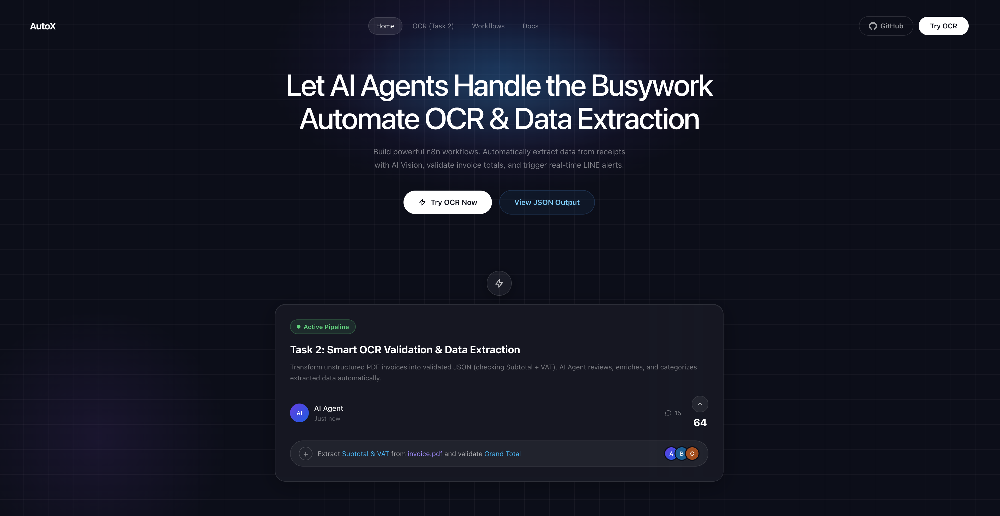
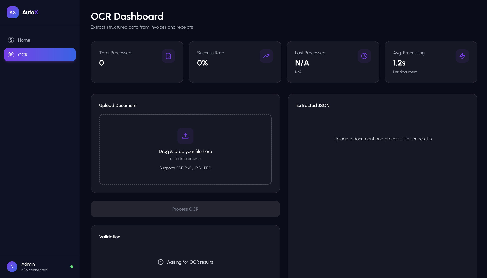
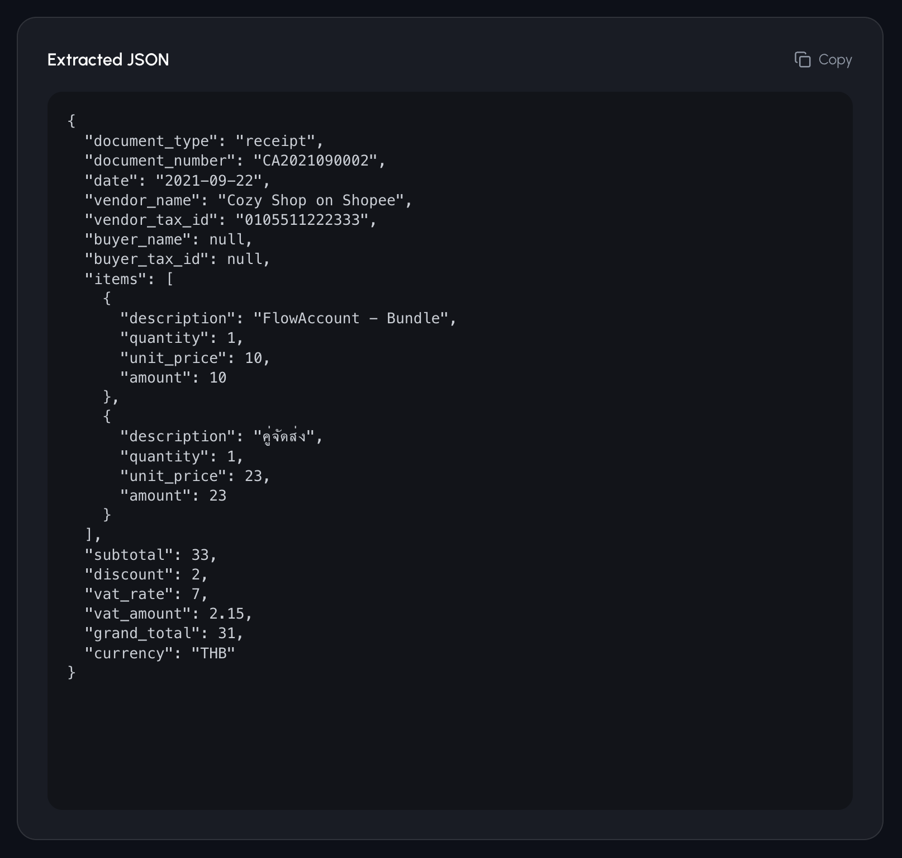

# AI Automation Dashboard — OCR to JSON

> **Live Demo**: [https://ai-automation-dashboard-seven.vercel.app](https://ai-automation-dashboard-seven.vercel.app)

Next.js dashboard that extracts structured JSON from invoices and receipts using AI Vision + n8n workflow validation.

## Architecture

```
User uploads PDF/Image
        |
   Next.js API (/api/ocr)
        |
   Cloudflare Workers AI (Llama 3.2 11B Vision)
        |  OCR + extract JSON
        v
   n8n Workflow (AI Agent - Data Reviewer)
        |  Groq (Llama 3.3 70B) reviews, enriches, categorizes
        |  Validate & Format node checks math
        v
   JSON Response with validation results
```

## Features

- Upload PDF or image (drag & drop)
- PDF auto-converted to image for Vision AI
- AI extracts: document info, items, subtotal, VAT, grand total
- n8n AI Agent reviews and enriches extracted data
- Validation: total calculation, VAT amount, items sum
- Dark theme dashboard with history tracking

## Getting Started

### 1. Install dependencies

```bash
npm install
```

### 2. Set up environment variables

```bash
cp .env.example .env.local
```

Fill in your keys:

| Variable | Description |
|----------|-------------|
| `CF_ACCOUNT_ID` | Cloudflare Account ID |
| `CF_API_TOKEN` | Cloudflare API Token (Workers AI access) |
| `N8N_OCR_WEBHOOK_URL` | n8n webhook URL (production URL) |

### 3. Import n8n workflow

Import `n8n-workflows/ocr-to-json.json` into your n8n instance, then:
- Add your Groq API credential to the "Groq Chat Model" node
- Activate the workflow
- Copy the **Production URL** from the Webhook node into `N8N_OCR_WEBHOOK_URL`

### 4. Run

```bash
npm run dev
```

Open [http://localhost:3000/ocr](http://localhost:3000/ocr)

## Project Structure

```
app/
  api/ocr/route.ts        # OCR API endpoint (Cloudflare Vision + n8n)
  ocr/page.tsx             # OCR Dashboard page
  page.tsx                 # Landing page
components/
  dashboard/               # Dashboard UI components
  landing/                 # Landing page components
n8n-workflows/
  ocr-to-json.json         # n8n workflow export
  ocr-sample-output.json   # Example output JSON
```

## Deliverables (สิ่งที่ส่งมอบ)

| # | รายการ | Path |
|---|--------|------|
| 1 | n8n workflow export | [`n8n-workflows/ocr-to-json.json`](n8n-workflows/ocr-to-json.json) |
| 2 | ตัวอย่างผลลัพธ์ JSON | [`n8n-workflows/ocr-sample-output.json`](n8n-workflows/ocr-sample-output.json) |
| 3 | n8n execution screenshots | [`n8n-workflows/screenshots/`](n8n-workflows/screenshots/) |
| 4 | Environment example | [`.env.example`](.env.example) |
| 5 | เว็บ Demo (Next.js) | [`app/`](app/) — deploy บน Vercel |

## Demo Screenshots

### Landing Page


### OCR Dashboard


## OCR Result (ผลลัพธ์จริง)



## Tech Stack

- **Frontend**: Next.js, Tailwind CSS
- **OCR**: Cloudflare Workers AI (Llama 3.2 11B Vision)
- **AI Agent**: n8n + Groq (Llama 3.3 70B)
- **PDF Processing**: pdf.js
